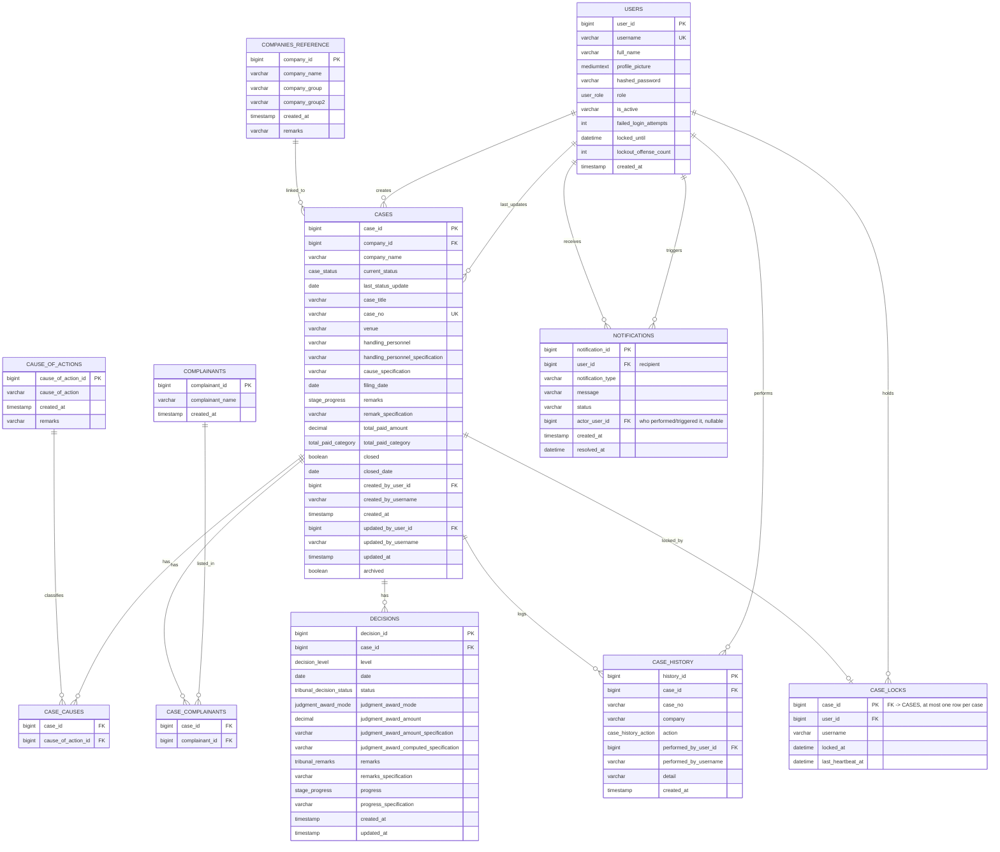

# Case Management Database Diagram

This ERD is grounded directly in the frontend's actual data model —
`types/case.ts`, `constants/caseOptions.ts`, `context/CasesContext.tsx`, and
`data/historyEvents.ts` — and in the backend's actual SQLAlchemy models
(`backend/app/models/`), rather than a general-purpose case-tracking schema.
It treats companies as a locally-seeded reference master list and
complainants as a local get-or-create reference table, while keeping cases,
per-stage decisions, joins, activity history, users, concurrent-edit locks,
and notifications as the app's own first-class tables.

## Enum Sets

- `case_status` (`CaseItem.status`): `Filed`, `Pending`, `Execution`, `Closed`
- `stage_progress` (`CaseItem.caseProgress.{la,nlrc,ca,sc}` **and** `CaseItem.remarks` — same three values in both, so one enum covers both): `Settled`, `Not Settled`, `Others` (unset state is `NULL`, not a 4th value — the frontend uses `""` for "not yet chosen")
- `decision_level`: `labor_arbiter`, `national_labor_relations_commission`, `court_of_appeals`, `supreme_court`
- `tribunal_decision_status` (`LaInfo/NlrcInfo/CaInfo/ScInfo.status`): `Valid Dismissal`, `Illegal Dismissal`, `Convicted`, `Acquitted`, `Dismissed`, `Affirmed`, `Pending`, `Closed`, `Execution`
- `tribunal_remarks` (`LaInfo/NlrcInfo/CaInfo/ScInfo.remarks`): `Appealed by Respondent`, `Appealed by Complainant`, `Not Appealed`, `Motion for Reconsideration`, `Other`. `Motion for Reconsideration` is backend-valid for all four stages (single shared MySQL enum, migration `a1c9e4f7b2d3`), but the frontend only exposes it as a selectable option on NLRC/CA/SC — LA keeps the original 4-option list. Backend validation (`case_validation_service.py`) explicitly rejects it if submitted for LA.
- `judgment_award_mode`: `amount`, `to_be_computed` — an award is either a numeric amount (with `judgment_award_amount_specification` as its basis note) or the literal `"To be computed"` (with `judgment_award_computed_specification` as its basis note); never both
- `total_paid_category` (`CaseItem.totalPaid.category`): `Judgment-Award-L`, `Judgment-Award-W`, `Settlement`
  - Display labels only (values unchanged): the frontend renders `Judgment-Award-W` as "Judgment (In Favor)" and `Judgment-Award-L` as "Judgment (Not In Favor)" everywhere shown to the user (form dropdown, Analytics, dashboard table, View Case modal), via `formatTotalPaidCategory()` in `caseHelpers.ts`. Stored/filtered values remain `Judgment-Award-W` / `Judgment-Award-L`.
- `case_history_action` (`HistoryEntry.action`): `created`, `updated`, `archived`, `restored`
- `user_role` (`users.role`): `admin`, `handling_personnel`, `viewer`. `viewer` is read-only across the case workflow — every mutating case/user/notification route is gated to `admin`/`handling_personnel` (or `admin` alone) via `require_role(...)` in `deps.py`.
- `notification_type` (`notifications.notification_type`, plain string, not a DB enum): `password_reset`, `case_update`, `password_changed`, `account_lockout`.
- `notification.status` (plain string, not a DB enum): `pending`, `approved`, `declined`, `unread`, `read`, `resolved` — the valid subset depends on `notification_type` (e.g. `password_reset` uses pending/approved/declined/resolved; `case_update` uses unread/read).

## Design Notes

- `complainants` and `cause_of_actions` are local get-or-create reference
  tables (see `crud/reference.py`), populated as cases are created — not
  API-fed from an external service. `companies_reference` is likewise a
  locally-owned master list, seeded and kept in sync from a
  supervisor-provided CSV (`backend/seed_data/company_list.csv`) via
  `backend/seed_companies.py`, which upserts by `company_name` and is safe
  to re-run whenever a new CSV drop arrives. `users` is also a
  locally-owned table (see below) rather than API-fed, since role and
  credentials need to live somewhere authoritative for this app.
- `company_name`, `created_by_username`, `updated_by_username`, and
  `case_history.company`/`case_history.case_no` are intentional snapshots
  for history, matching the pattern already used for reference-fed data
  elsewhere.
- `case_complainants` and `case_causes` are both join tables, since a case
  can have multiple complainants **and** multiple causes of action
  (`CaseDraft.complainants: string[]` and `CaseDraft.cause: string[]`).
- `decisions` stores at most one row per `(case_id, level)` — LA, NLRC, CA,
  SC — since the frontend models each stage as a single keyed object (`la`,
  `nlrc`, `ca`, `sc`), never an array. Enforced with a unique constraint on
  `(case_id, level)`.
- SEnA has no `decisions` row of its own — its fields (`company`, `status`,
  `case_title`, `case_no`, `venue`, `handling_personnel`, `cause`,
  `filing_date`, `remarks`) live directly on `cases`, matching how
  `CaseDraft` structures them.
- `total_paid_amount` / `total_paid_category` live on `cases`, not
  `decisions` — this is a case-level summary derived from whichever stage
  has the most recent judgment award (SC, then CA, NLRC, LA), computed by
  `getTotalJudgmentAward()` on the frontend and mirrored server-side by
  `_compute_total_paid_amount()` in `case_workflow_manager.py`, not a
  per-stage value.
- `closed` / `closed_date` map directly to `CaseItem.closed` /
  `CaseItem.closedDate`. This is a standalone lock flag set via "Close
  Case" in `CaseForm.tsx` (`POST /api/cases/{id}/close`) — it takes
  priority over stage/remarks progress in `getCaseStatusSummary()` and is
  independent of `total_paid_category`/settlement state. Admins can still
  update a closed case and can `unclose` it; non-admins are blocked from
  writing to a closed case both client-side and server-side.
- `case_history` is scoped specifically to case lifecycle events
  (create/update/archive/restore), matching exactly what `CasesContext.tsx`
  fetches and what the `/system/history` and `/system/activity` pages
  display — it is not a generic polymorphic audit log.
- `case_locks` holds at most one row per `case_id`, giving exactly one user
  at a time the right to edit that case (see `case_lock_service.py`). A
  lock is "stale" — and safely reclaimable by anyone — once
  `last_heartbeat_at` is older than the service's 60-second timeout, well
  above the frontend's ~20-second heartbeat interval. The row is deleted
  outright on explicit release (Cancel/Save/tab close) or when a new user
  reclaims a stale lock; it is never a durable "last editor" record, only a
  live editing-session marker.
- `notifications` is a generic per-user inbox, distinct from
  `case_history`: it drives the bell icon, the Notifications page, and the
  Activity page, and covers events that aren't case lifecycle events at all
  (password changes, account lockouts). `actor_user_id` is deliberately
  separate from the recipient `user_id` so a notification can show whose
  action it's about (e.g. "Maria updated your case…") distinct from who
  it's for; it's nulled (not cascade-deleted) when the actor account is
  later removed, via `crud/user.py::delete_user`, so old notifications
  survive with the recipient's copy intact.
- `users.role` now has three values (`admin`, `handling_personnel`,
  `viewer`); `viewer` is read-only across the entire case workflow.
  `failed_login_attempts` / `locked_until` / `lockout_offense_count`
  implement the tiered login-lockout policy in `auth_manager.py` (5 min → 1
  hr → 24 hr, capped, per persistent offense count). `profile_picture` is a
  `MEDIUMTEXT` column (base64 data URI, up to ~2 MB client-enforced) shown
  throughout the UI (sidebar, activity/history avatars).
- The database is the source of truth for case history, decisions, case
  locks, notifications, and case activity. The database is also now the
  source of truth for companies and complainants — both are locally-seeded
  reference tables, not fetched live from an external API.

## Seed Data

- Default seed user (`backend/seed.py`): `user_id=1`, `username='admin'`,
  `full_name='Current User'`, `role='admin'`, password
  `change-me-immediately` (change this immediately outside local dev).
- `backend/reset_all_passwords.py` is a separate, explicit deployment-prep
  utility that reissues a fresh random password for every existing user and
  writes them once to `credentials_output.csv` — it is not run as part of
  normal seeding and should be used deliberately.
- `backend/cleanup_data.sql` truncates all case-related tables
  (`case_locks`, `notifications`, `case_history`, `decisions`,
  `case_causes`, `case_complainants`, `cases`, `complainants`,
  `cause_of_actions`) ahead of a deployment — it does **not** touch `users`
  or `companies_reference`.
- `failed_login_attempts` / `lockout_offense_count` default to `0` and
  `locked_until` to `NULL` for every newly created user.

## Recommended Interpretation

- `company_id` as a proper FK (rather than a plain string) is the intended
  normalized state and is what the backend actually implements today —
  `CaseCreate`/`CaseUpdate` accept `company` as a string, but
  `case_workflow_manager.py` resolves it through `get_or_create_company` and
  stores the resulting `company_id` on `cases`.
- The diagram is intentionally practical: it matches the app's actual
  field-level structure today, including case locking and the
  notifications inbox, not a hypothetical full production schema.