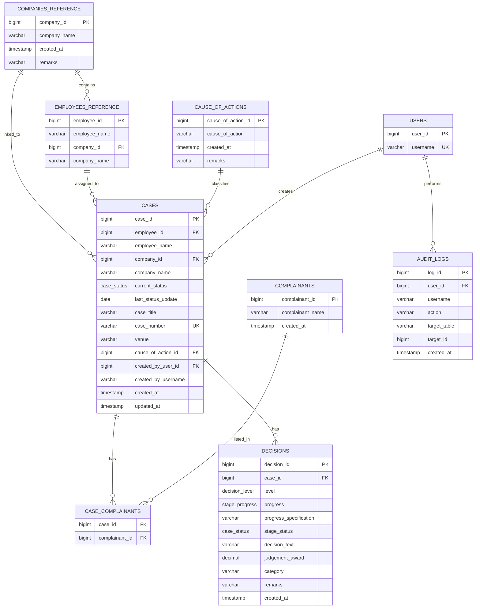

# Case Management Database Diagram

This is a solid base ERD for the system. It treats users, companies, and complainants as API-fed reference data coming from your supervisor's service, while keeping the local database focused on cases, stage decisions, joins, and audit history.

## Enum Sets

- `decision_level`: `labor_arbiter`, `national_labor_relations_commission`, `court_of_appeals`, `supreme_court`
- `case_status`: `FILED`, `PENDING`, `UNDER_REVIEW`, `DECIDED`, `APPEALED`, `CLOSED`, `DISMISSED`
- `stage_progress`: `Settled`, `Not Settled`, `Others`

## Design Notes

- `companies_reference`, `users`, and `complainants` are API-fed data, not local manual master tables.
- `employee_name`, `company_name`, `created_by_username`, and `audit_logs.username` are intentional snapshots for history.
- `case_complainants` supports one case with multiple complainants.
- `decisions` stores one row per case per tribunal level, which keeps LA, NLRC, CA, and SC history in one place.
- If you later want stronger normalization, `cases.employee_name` and `cases.company_name` can be treated strictly as reporting snapshots while the FK IDs remain the source of truth.

## Recommended Interpretation

- The API is the source of reference identity for users, companies, and complainants.
- The database is the source of truth for case history, decisions, and audit activity.
- The diagram is intentionally practical, so it matches your current app structure without pretending the backend already has a full production schema.
