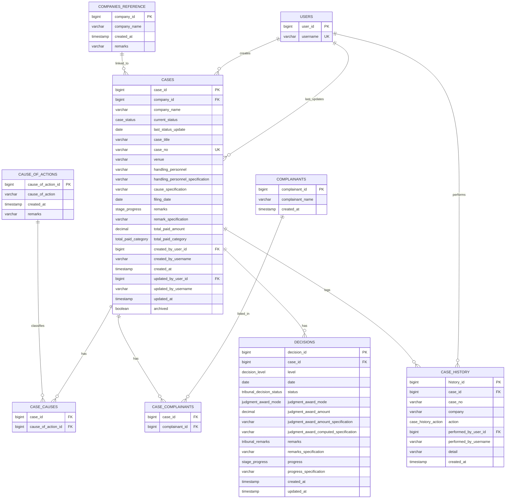

# Case Management Database Diagram

This ERD is grounded directly in the frontend's actual data model — `types/case.ts`, `constants/caseOptions.ts`, `context/CasesContext.tsx`, and `data/historyEvents.ts` — rather than a general-purpose case-tracking schema. It treats users, companies, and complainants as API-fed reference data coming from your supervisor's service, while keeping the local database focused on cases, per-stage decisions, joins, and case activity history.

## Enum Sets

- `case_status` (`CaseItem.status`): `Filed`, `Pending`, `Execution`, `Closed`
- `stage_progress` (`CaseItem.caseProgress.{la,nlrc,ca,sc}` **and** `CaseItem.remarks` — same three values in both, so one enum covers both): `Settled`, `Not Settled`, `Others` (unset state is `NULL`, not a 4th value — the frontend uses `""` for "not yet chosen")
- `decision_level`: `labor_arbiter`, `national_labor_relations_commission`, `court_of_appeals`, `supreme_court`
- `tribunal_decision_status` (`LaInfo/NlrcInfo/CaInfo/ScInfo.status`): `Valid Dismissal`, `Illegal Dismissal`, `Convicted`, `Acquitted`, `Dismissed`, `Affirmed`, `Pending`, `Closed`, `Execution`
- `tribunal_remarks` (`LaInfo/NlrcInfo/CaInfo/ScInfo.remarks`): `Appealed by Respondent`, `Appealed by Complainant`, `Not Appealed`, `Other`
- `judgment_award_mode`: `amount`, `to_be_computed` — an award is either a numeric amount (with `judgment_award_amount_specification` as its basis note) or the literal `"To be computed"` (with `judgment_award_computed_specification` as its basis note); never both
- `total_paid_category` (`CaseItem.totalPaid.category`): `Judgment-Award-L`, `Judgment-Award-W`, `Settlement`
- `case_history_action` (`HistoryEntry.action`): `created`, `updated`, `archived`, `restored`

## Design Notes

- `companies_reference`, `users`, and `complainants` are API-fed reference data, not local manual master tables.
- `company_name`, `created_by_username`, `updated_by_username`, and `case_history.company`/`case_history.case_no` are intentional snapshots for history, matching the pattern already used for reference-fed data elsewhere.
- `case_complainants` and `case_causes` are both join tables, since a case can have multiple complainants **and** multiple causes of action (`CaseDraft.complainants: string[]` and `CaseDraft.cause: string[]`).
- `decisions` stores at most one row per `(case_id, level)` — LA, NLRC, CA, SC — since the frontend models each stage as a single keyed object (`la`, `nlrc`, `ca`, `sc`), never an array. Enforce with a unique constraint on `(case_id, level)`.
- SEnA has no `decisions` row of its own — its fields (`company`, `status`, `case_title`, `case_no`, `venue`, `handling_personnel`, `cause`, `filing_date`, `remarks`) live directly on `cases`, matching how `CaseDraft` structures them.
- `total_paid_amount` / `total_paid_category` live on `cases`, not `decisions` — this is a case-level summary derived from whichever stage has the most recent judgment award (SC, then CA, NLRC, LA), computed by `getTotalJudgmentAward()`, not a per-stage value.
- `case_history` is scoped specifically to case lifecycle events (create/update/archive/restore), matching exactly what `CasesContext.tsx` logs and what the `/system/history` page displays — it is not a generic polymorphic audit log. If the app later needs to audit non-case entities, that would be a separate, more general table.
- The API is the source of reference identity for users, companies, and complainants; the current frontend placeholder (`CURRENT_USER = "Current User"`) means `created_by_username`/`performed_by_username` will be constant until real auth is wired in.
- The database is the source of truth for case history, decisions, and case activity.

## Recommended Interpretation

- `company_id` as a proper FK (rather than the plain string the frontend prototype currently uses for `CaseDraft.company`) is the intended normalized end-state, consistent with treating companies as API-fed reference data — not a literal 1:1 mirror of today's frontend, which just picks from a local string array.
- The diagram is intentionally practical: it matches the app's actual field-level structure today, not a hypothetical full production schema.